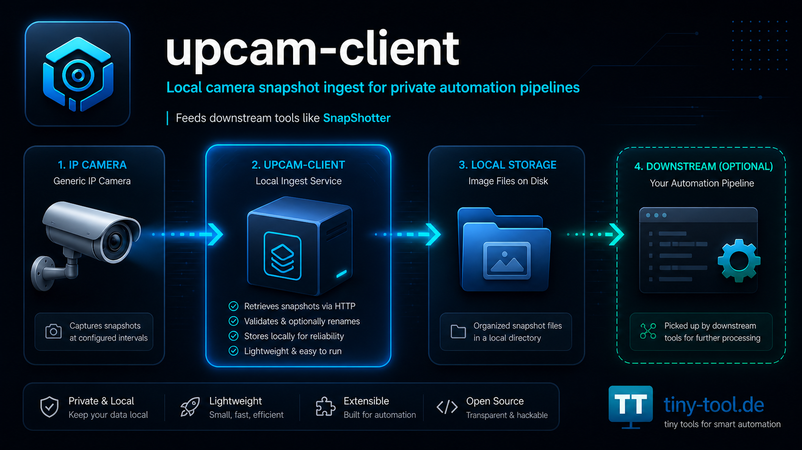

# 📸 SnapShotter


Bewegungsbewertung und optionale WhatsApp-Benachrichtigung für lokal gespeicherte Kamera-Snapshots.

Motion evaluation and optional WhatsApp notification for locally stored camera snapshots.

---



> Aus lokalen Kamerabildern werden gefilterte Ereignisse – optional mit Benachrichtigung per WhatsApp.  
> Local camera frames become filtered events – optionally delivered via WhatsApp.

---

# Deutsche Dokumentation

## ⚠️ Wichtiger Hinweis

`SnapShotter` ist ein privates Open-Source-Projekt für technisch versierte Nutzerinnen und Nutzer.

Das Projekt steht in keiner Verbindung zu WhatsApp, Meta, UpCam, Reolink oder deren Herstellern, Markeninhabern, Tochterunternehmen oder Vertriebspartnern.

WhatsApp, UpCam und Reolink sind Marken beziehungsweise Produktnamen ihrer jeweiligen Rechteinhaber. Die Nennung dient ausschließlich der technischen Beschreibung der verwendeten beziehungsweise kompatiblen Schnittstellen und Geräte.

Produktiver Einsatz kann möglich sein, erfolgt aber immer eigenverantwortlich.

Konfiguration, Betrieb, Datenschutz, Nachrichtenziele, Versandhäufigkeit, WhatsApp-Nutzung, Monitoring und Bewertung der automatisierten Benachrichtigungen liegen beim jeweiligen Betreiber.

---

## WhatsApp-Nutzung: Kein Spam, keine Massenbenachrichtigung

`SnapShotter` darf nicht für Spam, Massenversand, unerwünschte Nachrichten, Werbenachrichten oder sonstige missbräuchliche Kommunikation verwendet werden.

Der Betreiber ist selbst dafür verantwortlich, die jeweils gültigen WhatsApp-Regeln, Nutzungsbedingungen und Plattformrichtlinien einzuhalten.

Insbesondere gilt:

- keine unerwünschten Nachrichten
- kein Spam
- kein Marketingversand
- kein Bulk-Messaging
- keine Belästigung anderer Nutzerinnen und Nutzer
- keine automatisierte Kommunikation ohne legitimen Zweck und Zustimmung
- keine Nutzung gegen die WhatsApp-Nutzungsbedingungen

Dieses Projekt ist für private, kontrollierte Benachrichtigungen an eigene Geräte oder eigene Gruppen gedacht – nicht für Reichweite, Werbung oder Massenkommunikation.

Bei Verstößen können WhatsApp-Konten eingeschränkt oder gesperrt werden. Die Verantwortung liegt vollständig beim Betreiber.

---

## Was ist SnapShotter?

`SnapShotter` ist eine Node.js-Anwendung, die lokal gespeicherte Kamerabilder überwacht, bewertet und verarbeitet.

Die Anwendung kann neue Bilder aus einem Eingangsordner erkennen, einfache Bewegungs- und Änderungslogik anwenden und relevante Bilder optional an eine definierte WhatsApp-Gruppe oder einen definierten WhatsApp-Chat senden.

Kurz gesagt:

`upcam-client` holt die Bilder von der Kamera.  
`SnapShotter` entscheidet, ob daraus eine Benachrichtigung werden soll.

---

## Zusammenspiel mit upcam-client

SnapShotter ist der zweite Baustein einer zweistufigen Pipeline:

```text
IP-Kamera
   ↓
upcam-client
   ↓
./images/received/
   ↓
SnapShotter
   ↓
Filterung / Entscheidung / WhatsApp-Benachrichtigung
```

### Aufgabe von upcam-client

[`upcam-client`](https://github.com/gzeuner/upcam-client) ruft Snapshots von einer Kamera ab und speichert sie lokal.

### Aufgabe von SnapShotter

`SnapShotter` verarbeitet diese lokalen Bilder:

- Eingangsordner überwachen
- neue Frames erkennen
- Bewegungs-/Änderungslogik anwenden
- irrelevante Bilder aussortieren
- relevante Bilder optional per WhatsApp versenden
- Entscheidungen und Laufzeitstatus protokollieren

Beide Projekte können getrennt betrachtet werden, sind im praktischen Betrieb aber als gemeinsame Pipeline gedacht.

---

## Für wen ist dieses Projekt gedacht?

`SnapShotter` richtet sich an Nutzerinnen und Nutzer, die:

- lokale Kamerabilder automatisiert auswerten möchten
- einfache Ereignisbenachrichtigungen aufbauen möchten
- Snapshots nicht ungefiltert weiterleiten wollen
- technische Konfigurationen selbst prüfen können
- WhatsApp nur verantwortungsvoll und regelkonform einsetzen
- Betrieb, Datenschutz und Benachrichtigungen aktiv überwachen

Nicht geeignet ist das Projekt für Personen, die eine zertifizierte Alarmanlage, eine kommerzielle Sicherheitslösung, eine garantierte Bewegungserkennung oder ein WhatsApp-Marketing-Tool erwarten.

---

## Was SnapShotter nicht macht

`SnapShotter` ist kein vollständiges Sicherheitssystem.

Die Anwendung:

- ersetzt keine Alarmanlage
- ersetzt keine professionelle Videoüberwachung
- garantiert keine Bewegungserkennung
- garantiert keine Zustellung per WhatsApp
- darf nicht für Spam oder Massenversand verwendet werden
- prüft nicht automatisch, ob der WhatsApp-Einsatz erlaubt ist
- prüft nicht automatisch Datenschutz- oder Persönlichkeitsrechte
- ist keine offizielle WhatsApp-, Meta-, UpCam- oder Reolink-Software
- ist nicht für sicherheitskritische, medizinische oder behördliche Einsätze gedacht

Die Verantwortung für Betrieb, Datenschutz, Empfänger, Versandhäufigkeit und rechtmäßige Nutzung liegt beim Betreiber.

---

## Runtime Flow

```text
./images/received/
   ↓
neues Bild erkannt
   ↓
Bewegungs-/Signalbewertung
   ↓
Entscheidung
   ├── relevant       → ./images/sent/ oder WhatsApp-Versand
   └── nicht relevant → ./images/filtered/
   ↓
Status / Logs / Telemetrie
```

Typischer Ablauf:

1. `upcam-client` schreibt Bilddateien nach `./images/received/`
2. SnapShotter erkennt neue Bilder
3. SnapShotter bewertet Helligkeit, Änderung und Ereignislogik
4. relevante Bilder werden optional per WhatsApp gesendet
5. verworfene Bilder werden abgelegt
6. Entscheidungen und Laufzeitstatus werden protokolliert

---

## Features

- Überwachung eines lokalen Bildordners
- Verarbeitung neuer Kamera-Snapshots
- einfache Bewegungs- und Änderungsbewertung
- Helligkeits-/Signalfilter
- Ereignislogik gegen unnötige Mehrfachmeldungen
- optionale WhatsApp-Benachrichtigung
- Archivierung gesendeter Bilder
- Ablage gefilterter Bilder
- Laufzeitstatus über `.state`
- Log-Ausgaben für Betrieb und Fehlersuche
- Tests per npm

---

## Voraussetzungen

- Node.js 20 oder höher
- npm
- lokale Bildquelle, typischerweise `upcam-client`
- konfigurierter Eingangsordner
- optional: WhatsApp Web Session
- aktives Monitoring durch den Betreiber

---

## Installation

```bash
git clone https://github.com/gzeuner/SnapShotter.git
cd SnapShotter
npm ci
```

---

## Start

```bash
node src/SnapShotter.js
```

---

## Tests

```bash
npm test
```

---

## Konfiguration

Die Hauptkonfiguration liegt hier:

```text
src/config.js
```

Wichtige Bereiche:

```text
imageFilter.nativeSignal.*
imageFilter.delta.*
imageFilter.brightnessGuard.*
imageFilter.event.*
runtime.*
whatsapp.*
logging.*
```

Die konkreten Werte müssen zur eigenen Kamera, Bildfrequenz, Umgebung, Beleuchtung, Speicherstruktur und gewünschten Benachrichtigungslogik passen.

---

## Typische Ordnerstruktur

```text
images/
  received/    neue Bilder von upcam-client
  sent/        akzeptierte / versendete Bilder
  filtered/    verworfene Bilder

.state/
  runtime-health.json
  decisions.ndjson
  notifications.ndjson

logs/
```

---

## WhatsApp-Hinweise

SnapShotter kann WhatsApp Web technisch zur Benachrichtigung verwenden.

Wichtig:

- nur eigene oder ausdrücklich gewünschte Benachrichtigungen verwenden
- Empfänger bewusst auswählen
- Versandfrequenz begrenzen
- keine fremden Personen ungefragt anschreiben
- keine Werbung versenden
- keine Massenkommunikation aufbauen
- WhatsApp-Regeln regelmäßig prüfen
- Konto-Sperrungen einkalkulieren, wenn WhatsApp Nutzung als missbräuchlich bewertet

Empfohlen ist ein sehr enger, privater Einsatz, zum Beispiel:

```text
Kameraereignis → eigene private WhatsApp-Gruppe → Betreiber erhält Bild
```

Nicht empfohlen und nicht Zweck dieses Projekts:

```text
Kameraereignis → viele Empfänger
Kameraereignis → Marketing-Verteiler
Kameraereignis → ungefragte Kontakte
Kameraereignis → dauerhafte Nachrichtenflut
```

---

## Sicherheit und Datenschutz

Beim Betrieb einer Kamera-Pipeline entstehen Bilddaten. Diese können Personen, Fahrzeuge, Grundstücke oder andere sensible Informationen enthalten.

Der Betreiber ist verantwortlich für:

- rechtmäßige Kameraausrichtung
- Datenschutz und Persönlichkeitsrechte
- sichere Speicherung der Bilder
- sichere WhatsApp-Nutzung
- Zugriffsschutz auf Laufzeitordner
- Löschung alter Bilddaten
- Protokollierung und Monitoring
- Prüfung, ob Benachrichtigungen rechtmäßig und angemessen sind

Dieses Projekt liefert nur technische Bausteine. Es ersetzt keine rechtliche oder fachliche Prüfung.

---

## Operational Files

```text
.state/runtime-health.json      Laufzeitstatus
.state/decisions.ndjson         Bewertungsentscheidungen
.state/notifications.ndjson     Benachrichtigungsereignisse
logs/                           Logdateien
images/received/                Eingangsbilder
images/sent/                    akzeptierte / gesendete Bilder
images/filtered/                verworfene Bilder
```

---

## Commit-Hygiene

Nicht committen:

```text
.wwebjs_auth/
.wwebjs_cache/
.state/
images/
logs/
*.local.*
```

Optionaler Check vor dem Commit:

```bash
git diff --cached --name-only
git diff --cached | rg -n --pcre2 "(?i)(password|secret|token|api[_-]?key|authorization|bearer|BEGIN [A-Z ]*PRIVATE KEY|\b(10\.|192\.168\.|172\.(1[6-9]|2[0-9]|3[0-1])\.)\b)"
```

---

## Zugehöriges Projekt: upcam-client

[`upcam-client`](https://github.com/gzeuner/upcam-client) ist das passende Schwesterprojekt zu `SnapShotter`.

`upcam-client` übernimmt den Kamera-Ingest: Es ruft Snapshots von der IP-Kamera ab und speichert sie lokal.

`SnapShotter` übernimmt die nachgelagerte Verarbeitung: Es überwacht den Bildordner, bewertet neue Bilder und kann relevante Ereignisse optional per WhatsApp weiterleiten.

Für einen stabilen Betrieb sollten beide Projekte gemeinsam konfiguriert und getestet werden.

---

## Lizenz

MIT License

---

# English Documentation

## Important Notice

`SnapShotter` is a private open-source project for technically experienced users.

This project is not affiliated with WhatsApp, Meta, UpCam, Reolink or their manufacturers, trademark owners, subsidiaries or distributors.

WhatsApp, UpCam and Reolink are trademarks or product names of their respective owners. They are mentioned only to describe used or compatible interfaces and devices.

Production use may be possible, but always at your own responsibility.

The operator is responsible for configuration, operation, data protection, message targets, sending frequency, WhatsApp usage, monitoring and evaluation of automated notifications.

---

## WhatsApp Usage: No spam, no bulk messaging

`SnapShotter` must not be used for spam, bulk messaging, unwanted messages, advertising or abusive communication.

The operator is responsible for complying with the current WhatsApp rules, terms and platform policies.

This project is intended for private, controlled notifications to your own devices or own groups – not for reach, advertising or mass communication.

---

## What is SnapShotter?

`SnapShotter` is a Node.js application that monitors, evaluates and processes locally stored camera images.

It can detect new images in an input directory, apply simple motion/change logic and optionally send relevant images to a defined WhatsApp group or chat.

In short:

`upcam-client` fetches the images from the camera.  
`SnapShotter` decides whether a notification should be created.

---

## Pipeline

```text
IP camera
   ↓
upcam-client
   ↓
./images/received/
   ↓
SnapShotter
   ↓
filtering / decision / WhatsApp notification
```

## Related project: upcam-client

[`upcam-client`](https://github.com/gzeuner/upcam-client) is the matching ingest project.

`upcam-client` retrieves snapshots from the camera and stores them locally.  
`SnapShotter` watches that local image folder, evaluates new images and may forward relevant events.

---

## License

MIT License
